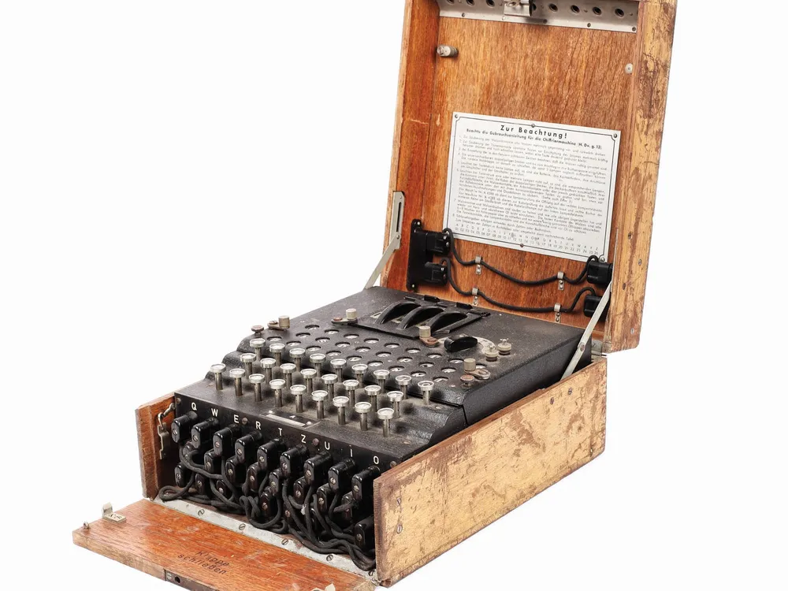

   

# Tiny Tapeout 10 - Enigma I Machine in Silicon!

Welcome to my contribution to Tiny Tapeout 10.  This is a complete, functional
implementation of the World War II era Enigma I cipher machine, implemented in a
160um x 100um footprint in SkyWater's 0.13um silicon CMOS process.

So, not only is it constructed mainly of sand, it's also only the size of a couple of grains of sand!

|A tale of two engimas | |
|---|---|
|Original Enigma I: 32cm x 26cm. *Image source[^1]*|  Silicon version: 0.16mm x 0.1mm|
|This version is only 6.4million times smaller!|

[^1]: https://www.smithsonianmag.com/smart-news/wwii-enigma-machine-found-flea-market-sells-51000-180964053/

# Documentation

[Read the documentation for project](docs/info.md) 

## What is Tiny Tapeout?

Tiny Tapeout is an educational project that aims to make it easier and cheaper than ever to get your digital and analog designs manufactured on a real chip.

To learn more and get started, visit https://tinytapeout.com.

