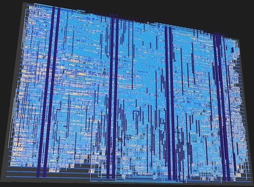

   

# Tiny Tapeout 10 - An Enigma I Machine Made Out of Silicon

Welcome to my contribution to Tiny Tapeout 10.  Once fabricated in March 2025,
this TT10 project will be a complete and functional model of the World War II era
Enigma I cipher machine, occupying an area of 160um x 100um in SkyWater's
0.13um silicon CMOS process.

So, not only will this Enigma be built primarily out of sand, but it
will also end up being smaller than a single grain of beach sand!

|A tale of two engimas | |
|---|---|
|Original Enigma I: 32cm x 26cm. *Image source[^1]*|  Silicon version: 0.16mm x 0.1mm|
||The silicon has a footprint that's 5.2 million times smaller than the original!

[^1]: https://www.smithsonianmag.com/smart-news/wwii-enigma-machine-found-flea-market-sells-51000-180964053/

# Documentation

- [Read the documentation for project](docs/info.md) 
- [See the interactive 3D viewer of the chip layout](https://virantha.github.io/tt10-enigma/)

## What is Tiny Tapeout?

Tiny Tapeout is an educational project that aims to make it easier and cheaper than ever to get your digital and analog designs manufactured on a real chip.

To learn more and get started, visit https://tinytapeout.com.

