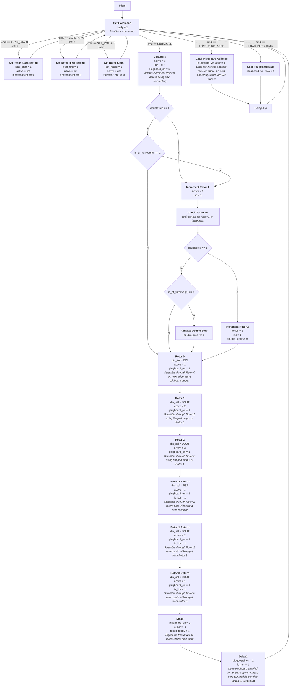

```mermaid
flowchart
    Initial
    GetCommand["`**Get Command**
        ready = 1
        *Wait for a command*
    `"]
    LoadStart["`**Set Rotor Start Setting**
        load_start = 1
        active = cnt
        if cnt==3: cnt <= 0
    `"]
    LoadRing["`**Set Rotor Ring Setting**
        load_ring = 1
        active = cnt
        if cnt==3: cnt <= 0
    `"]
    SetRotors["`**Set Rotor Slots**
        set_rotors = 1
        active = cnt
        if cnt==3: cnt <= 0
    `"]
    LoadPlugAddr["`**Load Plugboard Address**
        plugboard_wr_addr = 1 
        *Load the internal address register where the next LoadPlugBoardData will write to*
    `"]
    LoadPlugData["`**Load Plugboard Data**
        plugboard_wr_data = 1 
    `"]

    Scramble["`**Scramble**
        active = 1
        inc    = 1
        plugboard_en = 1 
        *Always increment Rotor 0 before doing any scrambling*
    `"]

    Rotor0["`**Rotor 0**
        din_sel = DIN
        active = 1
        plugboard_en = 1 
        *Scramble through Rotor 0 on next edge using pluboard output*
    `"]

    Rotor1["`**Rotor 1**
        din_sel = DOUT
        active = 2
        plugboard_en = 1 
        *Scramble through Rotor 1 using flopped output of Rotor 0*
    `"]

    Rotor2["`**Rotor 2**
        din_sel = DOUT
        active = 3
        plugboard_en = 1 
        *Scramble through Rotor 2 using flopped output of Rotor 1*
    `"]

    Rotor2back["`**Rotor 2 Return**
        din_sel = REF
        active = 3
        plugboard_en = 1 
        is_ltor = 1
        *Scramble through Rotor 2 return path with output from reflector*
    `"]

    Rotor1back["`**Rotor 1 Return**
        din_sel = DOUT
        active = 2
        plugboard_en = 1 
        is_ltor = 1
        *Scramble through Rotor 1 return path with output from Rotor 2*
    `"]

    Rotor0back["`**Rotor 0 Return**
        din_sel = DOUT
        active = 1
        plugboard_en = 1 
        is_ltor = 1
        *Scramble through Rotor 0 return path with output from Rotor 0*
    `"]

    Delay["`**Delay**
        plugboard_en = 1
        is_ltor =  1
        result_ready = 1
        *Signal the tresult will be ready on the next edge*
    `"]

    Delay2["`**Delay2**
        plugboard_en = 1
        is_ltor = 1
        *Keep plugboard enabled for an extra cycle to make sure top module can flop output of plugboard* 
    `"]

    IncRotor1["`**Increment Rotor 1**
        active = 2
        inc = 1
    `"]
    CheckTurnover["`**Check Turnover**
        *Wait a cycle for Rotor 1 to increment*
    `"]
    IncRotor2["`**Increment Rotor 2**
        active = 3
        inc = 1
        double_step <= 0
    `"]
    ActivateDoubleStep["`**Activate Double Step**
        double_step <= 1
    `"]

    Scramble --> IsDoubleStep
    IsDoubleStep{"doublestep == 1"}
    IsDoubleStep -- "Y" --> IncRotor1
    IsDoubleStep -- "N" --> IsAtTurnover

    IsAtTurnover{"is_at_turnover[0] == 1"}
    IsAtTurnover -- "Y" --> IncRotor1
    IsAtTurnover -- "N" --> Rotor0
    Rotor0 --> Rotor1
    Rotor1 --> Rotor2
    Rotor2 --> Rotor2back
    Rotor2back --> Rotor1back
    Rotor1back --> Rotor0back
    Rotor0back --> Delay
    Delay --> Delay2
    Delay2 --> GetCommand

    IncRotor1 --> CheckTurnover
    CheckTurnover --> IsDoubleStep2
    IsDoubleStep2{"doublestep == 1"}
    IsDoubleStep2 -- "Y" --> IncRotor2
    IsDoubleStep2 -- "N" --> IsAtTurnover1

    IsAtTurnover1{"is_at_turnover[1] == 1"}
    IsAtTurnover1 -- "Y" --> ActivateDoubleStep
    IsAtTurnover1 -- "N" --> Rotor0
    ActivateDoubleStep --> Rotor0
    IncRotor2 --> Rotor0

    Initial --> GetCommand
    GetCommand -- "`cmd == LOAD_START
    cnt++
    `" --> LoadStart
    LoadStart --> GetCommand


    GetCommand -- "`cmd == LOAD_RING
    cnt++
    `" --> LoadRing
    LoadRing --> GetCommand

    GetCommand -- "`cmd == SET_ROTORS
    cnt++
    `" --> SetRotors
    SetRotors --> GetCommand

    GetCommand --"`cmd == LOAD_PLUG_ADDR`"--> LoadPlugAddr
    LoadPlugAddr --> DelayPlug

    GetCommand --"`cmd == LOAD_PLUG_DATA`"--> LoadPlugData
    LoadPlugData --> DelayPlug

    DelayPlug --> GetCommand
    
    GetCommand -- "`cmd == SCRAMBLE
    `" --> Scramble


```