<!---

This file is used to generate your project datasheet. Please fill in the information below and delete any unused
sections.

You can also include images in this folder and reference them in the markdown. Each image must be less than
512 kb in size, and the combined size of all images must be less than 1 MB.
-->

## How it works

### Background
This project features a silicon implementation of a 52-bit equivalent key model
of the WWII-era Enigma code machine used by the Germans.  The British, led by
Alan Turing (as depicted in The Imitation Game), cracked this code, giving the
Allies a crucial advantage in the war.

This electronic version is accurate and will match any simulator you can find
on the web[^1][^2].  Although almost every Enigma operates
on similar principles, the particular model implemented here is 
the *Enigma I*[^3] used by the German Army and Air Force; it comes with 3 rotor
slots, the 5 original Rotors, the UKW-B Reflector, and plugboard.  The only
limitation is **that the plugboard only supports 3 wires**, whereas the actual
wartime procedure was to use up to 10 wires.  **This limits the key length of 
this implementation to 52-bits**.  The calculation is shown [below](#key-length-calculation).

[^1]: https://piotte13.github.io/enigma-cipher/
[^2]: https://www.dcode.fr/enigma-machine-cipher
[^3]: https://www.cryptomuseum.com/crypto/enigma/i/index.htm

### Key-length Calculation
The Enigma is a symmetric[^4] encryption engine, and the equivalent key length is comprised
of the different settings and ways the rotors and plugboard can be arranged.  See the 
excellent analysis[^5] from Dr. Ray Miller at NSA for more details on the calculations
below:

1. Selecting the three rotors, which can be arranged from right to left in any order:
    > 5 x 4 x 3 = **60** possible ways
2. Starting position of each rotor:
    > 26 * 26 * 26 = **17576**
3. Ring of each rotor (only two right rotors matter):
    > 26*26 = **676**
4. Plugboard with 3 wires (see table on p.9 for p=3[^3]):
    > 26choose3 / 2^3 
    
    > = 26! / (26-6)! / 3! / 8 =  **3,453,450** ways to plug in 3 wires

The total ways (# of keys) to set up this particular Enigma is therefore:

    60 * 17576 * 676 * 3,453,450 =  2,461,904,276,832,000 ways

yielding a key length of ~52-bits.

[^4]: https://crypto.stackexchange.com/questions/33628/how-many-possible-enigma-machine-settings
[^5]: https://www.nsa.gov/portals/75/documents/about/cryptologic-heritage/historical-figures-publications/publications/wwii/CryptoMathEnigma_Miller.pdf

### Implementation
It was my first time using the amazing Python-based hardware description tool
Amaranth HDL[^7] to build, test, and generate the Verilog implementation.  This
greatly simplified generating the hardware; because of the complexity of the way
the rotors map their inputs and outputs, I would've been writing Python scripts
anyway to generate all the case statements/control logic for the Verilog code.
Amaranth let me cut out all the overhead, and also integrate easily with my
reference Python implementation to generate tests.

[^7]: https://amaranth-lang.org/docs/amaranth/latest/

| Key statistics |  |
|-------------|-----|
| Utilization | 83% |
| Cells  | 1327|
| DFF    | 67 |
| Latches| 130|
| Frequency| 35MHz |

### Operation
When this Enigma machine is ready, it will accept 8-bits of input data (command
plus data) at the clk edge.  The internal state machine then takes
a varying number of clk cycles to respond, raising the "Ready" signal when it's
ready to accept the next command.  If the command generates an output, the raw
value will be output on the bidir pins, and the LCD display will show the
character generated.

|Description | Width| Direction | Signal(s)|
|------------|------|----|----|
|Command |3 | in | ui_in[7:5]|
|Data    |5 | in | ui_in[4:0]| 
|Scrambled output char| 5 | out | uio_out[4:0]|
|Ready | 1 |  out |uio_out[5]|
|7-segment LCD| 7| out | uo_out[6:0]|

#### Commands
The machine accepts the following 8 commands:
|Encoding[^6]| Command | Data |Description|
|----|----|---|---|
|000 | NOP | N/A | Do nothing |
|001 | LOAD_START | Setting 0-25 (A-Z) | Set the start position of a rotor.  Do this three times in succession to set each of the three rotors|
|010 | LOAD_RING | Setting 0-25 (A-Z) | Set the ring setting of a rotor.  Do this three times in succession to set each of the three rotors|
|011 | RESET | N/A | Go back to the initial state |
|100 | SCRAMBLE | Input char 0-25 (A-Z) | Run a letter through the rotor.  The Ready signal will be asserted when the scrambled character is output|
|101 | LOAD_PLUG_ADDR | Src 0-25 (A-Z) | Set an internal register to where the start of the plug should go.  This command should be followed by LOAD_PLUG_DATA to set the destination|
|110 | LOAD_PLUG_DATA | Dst 0-25 (A-Z) | Set the other end of the plug. Note that this connection is unidirectional, so if you want A,B connected, then you need to do two sequences of these commands to first set A->B and then B->A|
|111 | SET_ROTORS | Rotor 0-4 | Pick the Rotor type for each slot where Rotor I=0, Rotor II=1, ... Rotor V=4.  Do this three times in succession to pick each of the rotors (right to left). Default is Rotor I, II, III from right to left, where Rotor I is closest to the plugboard|

#### Sample run
TBD

[^6]: See the ```src/defines.py``` file
### Control FSM

The state machine diagram source can be found on github[^8].

[^8]: https://github.com/virantha/tt10-enigma/blob/main/docs/fsm.md


## How to test

## Explanation coming soon

### Design verification

1. Generate the verilog from the Amarangth HDL source

        cd tt10-enigma
        python -m src.top

    This will write a file `src/am_top.v` with the Enigma block.  This block is
    connected to the TinyTapeout harness using `src/project.v`

2. Run the functional test

        cd test
        make

3. Run the gate-level tests: After hardening (synthesis/pnr/gds), copy the gate_level_netlist.v into the test/ directory.  Then:

        make -B GATES=yes


## External hardware

List external hardware used in your project (e.g. PMOD, LED display, etc), if any
